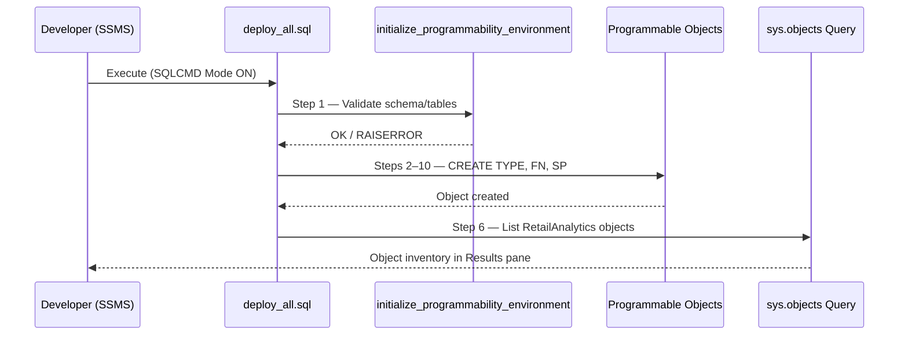
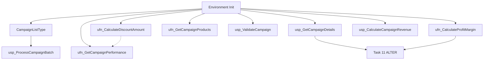

# Solution Architecture — Lab 6 Programmability Layer

**Course:** ITE-5223 SQL Server Database Development  
**Lab:** Lab 6 — SQL Server Programmability (Stored Procedures & Functions)  
**Database:** AdventureWorks2022  
**Schema:** `RetailAnalytics`  
**Repository:** [SQL-Server-Lab6-AdventureWorks](https://github.com/sahasri1807/SQL-Server-Lab6-AdventureWorks)

This document describes the solution architecture for the AdventureWorks Retail Analytics programmability layer. It is intended for developers, reviewers, and instructors evaluating design decisions, deployment order, and team ownership.

---

## Table of Contents

1. [System Overview & Business Case](#1-system-overview--business-case)
2. [Architecture Diagram](#2-architecture-diagram)
3. [Object Inventory](#3-object-inventory)
4. [Deployment Flow](#4-deployment-flow)
5. [Dependency Order](#5-dependency-order)
6. [Team RACI & Ownership](#6-team-raci--ownership)
7. [Data Flow Between Components](#7-data-flow-between-components)
8. [Error Handling Strategy](#8-error-handling-strategy)
9. [Folder Structure Explanation](#9-folder-structure-explanation)
10. [Related Documentation](#10-related-documentation)

---

## 1. System Overview & Business Case

### Business Context

AdventureWorks Corporation operates a multi-channel retail analytics platform. The `RetailAnalytics` schema (introduced in prior labs) stores marketing campaign metadata, sales transactions, product performance metrics, and territory-level rollups. Business analysts and BI applications consume this data for campaign ROI reporting, discount analysis, and batch campaign processing.

### Problem Statement

Prior labs established relational tables and views. Application teams currently embed complex T-SQL for validation, revenue aggregation, and batch operations directly in client code. This creates:

- Duplicated business logic across reports and ETL jobs
- Inconsistent error handling and validation rules
- Difficult maintenance when campaign rules change
- No standardized deployment pipeline for database objects

### Solution

Lab 6 delivers a **programmability layer** — a cohesive set of stored procedures, scalar functions, table-valued functions, and user-defined table types — that encapsulates retail analytics business logic inside SQL Server. Objects are:

- **Schema-qualified** under `RetailAnalytics`
- **Deployed atomically** via SQLCMD orchestration (`deploy_all.sql`)
- **Tested** with dedicated invocation and parameter test scripts
- **Maintainable** through scripted ALTER and DROP lifecycle scripts

### Success Criteria

| Criterion | Measure |
|-----------|---------|
| Functional completeness | All 13 lab tasks implemented; objects execute without error |
| Encapsulation | Business logic lives in SPs/functions, not ad-hoc queries |
| Testability | Three test scripts cover OUTPUT params, TVPs, and invocation patterns |
| Operability | Single-command deployment; post-deploy verification query |
| Evidence | 14 screenshot categories captured for grading |

---

## 2. Architecture Diagram

### Logical Architecture

```mermaid
flowchart TB
    subgraph Client["Client Layer"]
        SSMS["SSMS / SQLCMD"]
        BI["BI Reports & Apps"]
    end

    subgraph Deploy["Deployment Layer"]
        INIT["initialize_programmability_environment.sql"]
        DEPLOY["deploy_all.sql"]
    end

    subgraph Types["Type Layer"]
        TVP["CampaignListType<br/>(User-Defined Table Type)"]
    end

    subgraph Functions["Function Layer"]
        SCF1["ufn_CalculateDiscountAmount<br/>(Scalar)"]
        SCF2["ufn_CalculateProfitMargin<br/>(Scalar)"]
        ITVF["ufn_GetCampaignProducts<br/>(Inline TVF)"]
        MSTVF["ufn_GetCampaignPerformance<br/>(Multi-Statement TVF)"]
    end

    subgraph Procedures["Procedure Layer"]
        VAL["usp_ValidateCampaign"]
        GET["usp_GetCampaignDetails"]
        REV["usp_CalculateCampaignRevenue"]
        BATCH["usp_ProcessCampaignBatch"]
    end

    subgraph Data["Data Layer — RetailAnalytics Schema"]
        CAMP["Campaign"]
        CSALES["CampaignSales"]
        CPERF["CampaignPerformance"]
        PPERF["ProductPerformance"]
    end

    subgraph Test["Testing Layer"]
        T1["test_output_parameters.sql"]
        T2["tvp_batch_test.sql"]
        T3["stored_procedure_invocation_tests.sql"]
    end

    subgraph Maint["Maintenance Layer"]
        ALT["programmable_object_modification.sql"]
        DROP["programmable_object_removal.sql"]
    end

    SSMS --> DEPLOY
    DEPLOY --> INIT
    DEPLOY --> TVP
    DEPLOY --> SCF1 & SCF2 & ITVF & MSTVF
    DEPLOY --> VAL & GET & REV & BATCH

    BI --> VAL & GET & REV & BATCH
    BI --> SCF1 & SCF2 & ITVF & MSTVF

    BATCH --> TVP
    MSTVF -.->|may call| SCF1
    VAL & GET & REV & BATCH --> CAMP & CSALES & CPERF & PPERF
    ITVF --> PPERF
    MSTVF --> CPERF

    SSMS --> T1 & T2 & T3
    T1 --> REV
    T2 --> BATCH
    T3 --> VAL & GET & REV & BATCH

    SSMS --> ALT & DROP
    ALT --> GET & SCF2
    DROP --> Procedures & Functions & Types
```



### Deployment Pipeline



---

## 3. Object Inventory

All programmable objects are created in the **`RetailAnalytics`** schema on **`AdventureWorks2022`**.

### User-Defined Table Types

| Object | Type | Script | Owner | Description |
|--------|------|--------|-------|-------------|
| `RetailAnalytics.CampaignListType` | TABLE TYPE (TVP) | `types/CampaignListType.sql` | Lien | READONLY table-valued parameter for batch campaign processing; contains `CampaignID` column |

### Stored Procedures

| Object | Script | Owner | Key Parameters | Return Pattern |
|--------|--------|-------|----------------|----------------|
| `RetailAnalytics.usp_ValidateCampaign` | `procedures/usp_ValidateCampaign.sql` | Parth | `@CampaignID`, `@IsValid OUTPUT`, `@Message OUTPUT` | TRY/CATCH; validation return codes |
| `RetailAnalytics.usp_GetCampaignDetails` | `procedures/usp_GetCampaignDetails.sql` | Kelvin | `@CampaignID` | Return codes: `0` success, `-1` not found, `-2` error |
| `RetailAnalytics.usp_CalculateCampaignRevenue` | `procedures/usp_CalculateCampaignRevenue.sql` | Hassana | `@CampaignID`, `@TotalRevenue OUTPUT`, `@TotalOrders OUTPUT` | Aggregates from `CampaignSales` |
| `RetailAnalytics.usp_ProcessCampaignBatch` | `procedures/usp_ProcessCampaignBatch.sql` | Lien | `@CampaignList CampaignListType READONLY` | TVP batch processing |

### Scalar Functions

| Object | Script | Owner | Parameters | Notes |
|--------|--------|-------|------------|-------|
| `RetailAnalytics.ufn_CalculateDiscountAmount` | `functions/ufn_CalculateDiscountAmount.sql` | Brian | `@SalesAmount`, `@DiscountRate` | Returns computed discount |
| `RetailAnalytics.ufn_CalculateProfitMargin` | `functions/ufn_CalculateProfitMargin.sql` | Dhruv | `@Revenue`, `@Cost` | Division-by-zero guard added in Task 11 ALTER |

### Table-Valued Functions

| Object | Script | Owner | Type | Parameters |
|--------|--------|-------|------|------------|
| `RetailAnalytics.ufn_GetCampaignProducts` | `functions/ufn_GetCampaignProducts.sql` | Sahil | Inline TVF | `@CampaignID` |
| `RetailAnalytics.ufn_GetCampaignPerformance` | `functions/ufn_GetCampaignPerformance.sql` | Sahil | Inline/Multi-statement TVF | `@CampaignID` (optional filter) |

### Supporting Scripts (Non-Deploy)

| Script | Folder | Owner | Purpose |
|--------|--------|-------|---------|
| `initialize_programmability_environment.sql` | `scripts/` | Sahasri | Task 1 — environment verification |
| `deploy_all.sql` | `deployment/` | Sahasri | Task 13 — master SQLCMD deployment |
| `test_output_parameters.sql` | `testing/` | Hassana | OUTPUT parameter test harness |
| `tvp_batch_test.sql` | `testing/` | Lien | TVP batch execution sample |
| `stored_procedure_invocation_tests.sql` | `testing/` | Brian | Task 10 — EXEC patterns, return codes, TVP |
| `programmable_object_modification.sql` | `maintenance/` | Joshua | Task 11 — ALTER PROCEDURE & ALTER FUNCTION |
| `programmable_object_removal.sql` | `maintenance/` | Joshua | Task 12 — DROP with existence checks |

---

## 4. Deployment Flow

### Prerequisites

1. SQL Server 2019+ with `AdventureWorks2022` restored
2. `RetailAnalytics` schema and Lab 5 tables populated
3. SSMS with **SQLCMD Mode** enabled
4. `db_ddladmin` or equivalent permissions

### Standard Deployment (Production Path)

```
┌─────────────────────────────────────────────────────────────────┐
│  1. Open SSMS → Connect to instance → USE AdventureWorks2022    │
│  2. Enable Query → SQLCMD Mode                                  │
│  3. Open Lab6/deployment/deploy_all.sql                         │
│  4. Execute (F5) — script :r-includes all object scripts        │
│  5. Review Messages pane + post-deploy sys.objects verification │
└─────────────────────────────────────────────────────────────────┘
```

### Post-Deploy Testing (Manual)

Run scripts from `Lab6/testing/` **after** successful deployment:

1. `test_output_parameters.sql` — validates `@TotalRevenue` / `@TotalOrders`
2. `tvp_batch_test.sql` — populates TVP variable, executes batch SP
3. `stored_procedure_invocation_tests.sql` — comprehensive invocation demo

### Maintenance Operations (Optional / Reset)

| When | Script | Action |
|------|--------|--------|
| After initial deploy + testing | `maintenance/programmable_object_modification.sql` | ALTER existing objects (Task 11) |
| Lab reset / teardown only | `maintenance/programmable_object_removal.sql` | DROP objects in reverse dependency order |

> **Important:** `programmable_object_removal.sql` is **excluded** from `deploy_all.sql`. Run only when intentionally resetting the environment.

---

## 5. Dependency Order

Objects must be created in dependency order. `deploy_all.sql` enforces this sequence:

| Step | Order | Script | Depends On | Rationale |
|------|-------|--------|------------|-----------|
| 1 | FIRST | `scripts/initialize_programmability_environment.sql` | Lab 5 `RetailAnalytics` tables | Validates environment before DDL |
| 2 | 2 | `types/CampaignListType.sql` | Step 1 | TVP required by batch SP |
| 3 | 3a | `functions/ufn_CalculateDiscountAmount.sql` | Step 1 | Standalone scalar function |
| 4 | 3b | `functions/ufn_CalculateProfitMargin.sql` | Step 1 | Standalone scalar function |
| 5 | 4a | `functions/ufn_GetCampaignProducts.sql` | Step 1, `ProductPerformance` | Inline TVF |
| 6 | 4b | `functions/ufn_GetCampaignPerformance.sql` | Step 1, optionally Step 3a | May reference discount function |
| 7 | 5a | `procedures/usp_ValidateCampaign.sql` | Step 1 | Independent validation SP |
| 8 | 5b | `procedures/usp_GetCampaignDetails.sql` | Step 1 | Retrieval SP (ALTER in Task 11) |
| 9 | 5c | `procedures/usp_CalculateCampaignRevenue.sql` | Step 1, `CampaignSales` | OUTPUT parameter SP |
| 10 | 5d | `procedures/usp_ProcessCampaignBatch.sql` | Step 2 (TVP) | TVP-dependent SP — **must be last among SPs** |
| — | POST | `testing/*.sql` | Respective objects | Run manually after deploy |
| — | POST | `maintenance/programmable_object_modification.sql` | Steps 4b, 5b | ALTER after originals exist |
| — | RESET | `maintenance/programmable_object_removal.sql` | All objects deployed | Reverse-order DROP |

### Dependency Graph (Simplified)



---

## 6. Team RACI & Ownership

**Legend:** R = Responsible · A = Accountable · C = Consulted · I = Informed

### Person-to-Task Mapping

| Person | Role | Primary Tasks | Scripts Owned |
|--------|------|---------------|---------------|
| **Sahasri** | Team Lead & Integrator | Task 1, Task 13 | `initialize_programmability_environment.sql`, `deploy_all.sql`, repo integration |
| **Parth** | Validation SP Developer | Task 2 | `usp_ValidateCampaign.sql` |
| **Kelvin** | Campaign Retrieval SP Developer | Task 3 | `usp_GetCampaignDetails.sql` |
| **Hassana** | Revenue Calculation SP Developer | Task 4 | `usp_CalculateCampaignRevenue.sql`, `test_output_parameters.sql` |
| **Lien** | TVP & Batch Processing Developer | Task 5 | `CampaignListType.sql`, `usp_ProcessCampaignBatch.sql`, `tvp_batch_test.sql` |
| **Brian** | Discount Function + Invocation Tests | Task 6, Task 10 | `ufn_CalculateDiscountAmount.sql`, `stored_procedure_invocation_tests.sql` |
| **Dhruv** | Profit Margin Function Developer | Task 7 | `ufn_CalculateProfitMargin.sql` |
| **Sahil** | TVF Developer | Task 8, Task 9 | `ufn_GetCampaignProducts.sql`, `ufn_GetCampaignPerformance.sql` |
| **Joshua** | Maintenance, Lifecycle & QA | Task 11, Task 12, Screenshots | `programmable_object_modification.sql`, `programmable_object_removal.sql`, `screenshots/` |

### RACI Matrix (Selected Activities)

| Activity | Sahasri | Parth | Kelvin | Hassana | Lien | Brian | Dhruv | Sahil | Joshua |
|----------|---------|-------|--------|---------|------|-------|-------|-------|--------|
| Task 1 — Environment Init | **R** | I | I | I | I | I | I | I | I |
| Task 2 — ValidateCampaign | A | **R** | I | I | I | I | I | I | I |
| Task 3 — GetCampaignDetails | A | I | **R** | I | I | I | I | I | C |
| Task 4 — CalculateCampaignRevenue | A | I | I | **R** | I | C | I | I | I |
| Task 5 — TVP & Batch | A | I | I | I | **R** | C | I | I | I |
| Task 6 — Discount Function | A | I | I | I | I | **R** | I | C | I |
| Task 7 — Profit Margin Function | A | I | I | I | I | I | **R** | C | C |
| Task 8–9 — TVFs | A | I | I | I | I | I | I | **R** | I |
| Task 10 — Invocation Tests | A | C | C | C | C | **R** | I | I | I |
| Task 11 — Object Modification | A | I | C | I | I | I | C | I | **R** |
| Task 12 — Object Removal | A | I | I | I | I | I | I | I | **R** |
| Task 13 — deploy_all.sql | **R** | I | I | I | I | I | I | I | I |
| Screenshots (14 categories) | A | I | I | I | I | I | I | I | **R** |
| Final Integration Test | **R** | C | C | C | C | C | C | C | C |

Sahasri is **Accountable** for all deliverables; each developer is **Responsible** for their assigned scripts.

---

## 7. Data Flow Between Components

### Campaign Validation Flow

```
Client/App
    │
    ▼
usp_ValidateCampaign(@CampaignID, @IsValid OUT, @Message OUT)
    │
    ├──► RetailAnalytics.Campaign  (existence, date range, status)
    │
    └──► Returns @IsValid bit + descriptive @Message
```

### Revenue Calculation Flow

```
Client/App
    │
    ▼
usp_CalculateCampaignRevenue(@CampaignID, @TotalRevenue OUT, @TotalOrders OUT)
    │
    └──► RetailAnalytics.CampaignSales  (SUM revenue, COUNT orders)
              │
              └──► test_output_parameters.sql validates OUTPUT capture
```

### Batch Processing Flow (TVP)

```
Client/App
    │
    ├──► DECLARE @List RetailAnalytics.CampaignListType
    ├──► INSERT INTO @List (CampaignID) VALUES (...)
    │
    ▼
usp_ProcessCampaignBatch(@CampaignList READONLY)
    │
    ├──► Iterates/joins TVP rows against Campaign + CampaignSales
    └──► Returns aggregated batch results per campaign
```

### Analytics Query Flow (Functions)

```
Reporting Layer
    │
    ├──► ufn_GetCampaignProducts(@CampaignID)
    │         └──► ProductPerformance + Product + Category joins
    │
    ├──► ufn_GetCampaignPerformance(@CampaignID)
    │         └──► CampaignPerformance aggregates
    │         └──► ufn_CalculateDiscountAmount (computed discount column)
    │
    ├──► ufn_CalculateDiscountAmount(@SalesAmount, @DiscountRate)
    │
    └──► ufn_CalculateProfitMargin(@Revenue, @Cost)
```

---

## 8. Error Handling Strategy

### Design Principles

1. **Fail fast on invalid input** — validate parameters at the top of each procedure before touching data
2. **Structured return codes** — procedures use consistent integer return values (`0` = success, negative = domain errors)
3. **TRY/CATCH everywhere** — all stored procedures wrap logic in `BEGIN TRY / BEGIN CATCH`
4. **Schema-qualified names** — prevents ambiguity and supports explicit error context
5. **Existence checks before DDL** — `IF OBJECT_ID(...) IS NOT NULL DROP` pattern in every script
6. **No silent failures** — errors propagate via `THROW` or `RAISERROR` with meaningful messages

### Standard Patterns

#### Stored Procedure Error Block (Parth — Task 2 template)

```sql
BEGIN TRY
    SET NOCOUNT ON;
    -- Business logic
END TRY
BEGIN CATCH
    SET @IsValid = 0;
    SET @Message = ERROR_MESSAGE();
    -- Optional: log error number, re-throw for critical failures
    RETURN ERROR_NUMBER();
END CATCH
```

#### Return Code Convention (Kelvin — Task 3)

| Code | Meaning |
|------|---------|
| `0` | Success — campaign found and returned |
| `-1` | Campaign not found |
| `-2` | Unexpected error / catch block |

#### Scalar Function Guard (Dhruv — Task 7 / Task 11 ALTER)

```sql
-- Division-by-zero protection in ufn_CalculateProfitMargin
IF @Revenue IS NULL OR @Revenue = 0
    RETURN NULL;  -- or 0 per lab spec
```

#### Deployment Error Handling

- `deploy_all.sql` uses `GO` batch separators — a failure stops the current batch
- Developer must fix the failing script, re-run from that step or full redeploy
- Post-deploy verification query lists all objects; missing rows indicate partial deploy

#### Removal Safety (Joshua — Task 12)

`programmable_object_removal.sql` drops in **reverse dependency order** with `IF OBJECT_ID` checks to avoid orphaned-type errors (TVP dropped after dependent SPs).

---

## 9. Folder Structure Explanation

```
SQL-Server-Lab6-AdventureWorks/
│
├── README.md                          ← Repository entry point; quick start & team index
├── .gitignore                         ← Excludes .bak, SSMS project files, secrets
├── scripts/                           ← Solution architecture documentation
│   └── README.md
│
└── Lab6/                              ← All lab artifacts (SSMS working root)
    ├── README.md                      ← Detailed lab guide, checklist, git workflow
    │
    ├── scripts/                       ← Pre-deploy infrastructure
    │   └── initialize_programmability_environment.sql
    │
    ├── types/                         ← User-defined table types (TVPs)
    │   └── CampaignListType.sql
    │
    ├── functions/                     ← Scalar & table-valued functions
    │   ├── ufn_CalculateDiscountAmount.sql
    │   ├── ufn_CalculateProfitMargin.sql
    │   ├── ufn_GetCampaignProducts.sql
    │   └── ufn_GetCampaignPerformance.sql
    │
    ├── procedures/                    ← Stored procedures
    │   ├── usp_ValidateCampaign.sql
    │   ├── usp_GetCampaignDetails.sql
    │   ├── usp_CalculateCampaignRevenue.sql
    │   └── usp_ProcessCampaignBatch.sql
    │
    ├── testing/                       ← Post-deploy validation (NOT in deploy_all)
    │   ├── test_output_parameters.sql
    │   ├── tvp_batch_test.sql
    │   └── stored_procedure_invocation_tests.sql
    │
    ├── maintenance/                   ← Lifecycle scripts (ALTER / DROP)
    │   ├── programmable_object_modification.sql
    │   └── programmable_object_removal.sql
    │
    ├── deployment/                    ← SQLCMD master orchestrator
    │   └── deploy_all.sql
    │
    └── screenshots/                   ← Grading evidence (14 PNG categories)
        └── README.md
```

### Folder Design Rationale

| Folder | Separation Reason |
|--------|-------------------|
| `scripts/` | Environment/bootstrap — runs once before any DDL |
| `types/` | TVPs are a distinct object class with strict ordering requirements |
| `functions/` | Reusable computation — no side effects; consumed by SPs and reports |
| `procedures/` | Transactional business operations with parameters and side effects |
| `testing/` | Kept out of deploy pipeline to avoid accidental test data mutation |
| `maintenance/` | ALTER/DROP are lifecycle operations, not initial deploy |
| `deployment/` | Single entry point for instructors and CI-style reproducibility |
| `screenshots/` | Evidence artifacts separated from executable code |

---

## 10. Related Documentation

| Document | Location | Purpose |
|----------|----------|---------|
| Repository README | [`../README.md`](../README.md) | Quick start, team roster, script inventory |
| Lab 6 Developer Guide | [`../Lab6/README.md`](../Lab6/README.md) | SSMS setup, SQLCMD, submission checklist |
| Screenshot Guide | [`../Lab6/screenshots/README.md`](../Lab6/screenshots/README.md) | 14 required evidence categories |
| Team Plan (source) | `excel_plan_data.json` | RACI, estimates, dependency map from Excel |

---

*ITE-5223 SQL Server Database Development — Georgia Institute of Technology — Lab 6 Solution Architecture*
